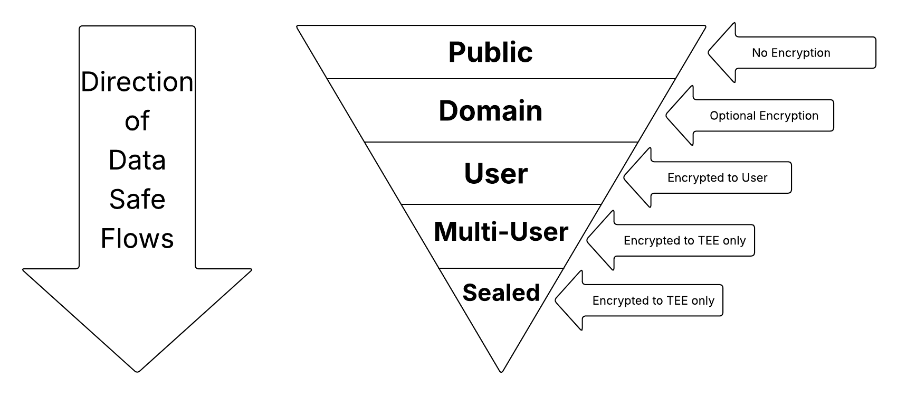
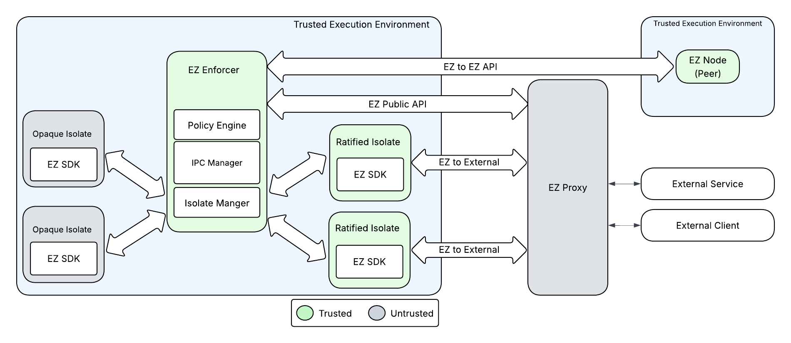

# Encrypted Zone Prototype

## Overview

Encrypted Zone (EZ) is a privacy enhancing platform that enforces privacy and security policy for
workloads running on a TEE platform. EZ uses a **Policy Enforcer** to decouple privacy enforcement
from business logic. This architecture simplifies many of the complexities of confidential or
private computing, across many governance and transparency models.

EZ allows developers to:

-   **Enforce Privacy Policies**: Explicitly control how data is used in a robust, verifiable way.
-   **Reduce Overhead**: Keeping enforcement separate allows developers to minimize the compute and
    development cost of building private-by-design systems.
-   **Remain Enclave-Agnostic**: EZ is a generic framework designed to run on any public or private
    cloud.

Note that this early version of Encrypted Zone is intended to demonstrate the design pattern, and
does not include several crucial features that would be necessary to secure a production system for
general use. See [What's Next](#whats-next) for examples of future development areas.

### Use Cases

EZ targets two primary use cases:

1. applying transparent open-source privacy policies to the operation of proprietary closed-source
   servers
2. facilitating integration with legacy server codebases

EZ addresses the first by operating as an Enforcer middleware layer in each node, interposing server
communications to apply policy controls to all data flows. This layer is compatible with common
Linux-based platforms running in a
[Trusted Execution Environment (TEE)](https://en.wikipedia.org/wiki/Trusted_execution_environment).

For the second use case, EZ provides an [SDK](#3-ez-sdk) that minimizes required source-code
modifications. The SDK includes tools like a gRPC-compatible protobuf code generator that replaces
the network layer, enabling a "lift and shift" approach for existing gRPC services to communicate
via the Enforcer's IPC bridge.

## Trust & Security Model

### Identity and Authentication

EZ workload identity consists of `trust_domain`, `operator_domain`, `publisher_id`, and
`isolate_name`. These are used in combination for federation and policy enforcement purposes.

-   `trust_domain`: Root of trust e.g. Root CA for a set of EZ nodes to establish mutual trust.
-   `operator_domain`: Unique identifier for a service provider who operates the EZ node,
    facilitating as a security boundary. For example, it can be an IAM role.
-   `publisher_id`: An email identifier for who publishes and signs an isolate or EZ node.
-   `isolate_name`: An identifier for isolate qualified by `publisher_id` to identify what service
    the binary is providing.

The workload identity is authenticated by
[Private Key Infrastructure](https://en.wikipedia.org/wiki/Public_key_infrastructure) (PKI) and used
in the [mTLS](https://en.wikipedia.org/wiki/Mutual_authentication#:~:text=%5B5%5D-,mTLS,-%5Bedit%5D)
certificate to establish secure and authenticated channels with peer EZ nodes.

### Data Scopes

Data flowing through the Node is tagged with "Data Scopes" which are tiered privacy levels.

Data Scopes define basic egress rules based on data type, ranging from least to most restrictive:

1. **`PUBLIC`**: Data can egress safely as plaintext.
2. **`DOMAIN_OWNED`**: Restricted to a specific domain owner if egressed.
3. **`USER_PRIVATE`**: User data egressed only with end-to-end encryption to the owning user.
4. **`MULTI_USER_PRIVATE`**: Multiple user data egressed only encrypted with key material that does
   not leave EZ.
5. **`SEALED`**: Data egressed only encrypted with key material that does not leave EZ (ownership
   untracked).

An Isolate can be assigned exactly one Data Scope at a time by the Enforcer which can change
dynamically over time as the Isolate receives private data. The Isolate Data Scope can only become
more strict, unless the Isolate is reset. The Enforcer enforces egress rules based on these scopes;
for example, USER_PRIVATE data is only egressed via end-to-end encrypted channels to the user.

### Attestation

Before processing sensitive data, the Node can be challenged by a client. The hardware generates a
signed report proving it is a genuine TEE and provides a hash of the loaded software (the Enforcer).

## Architecture

The EZ Node architecture is designed to enforce security and privacy at the execution level. The
high-level structure includes:

-   Cloud Node (Machine): The host server provided by an operator or cloud provider.
-   TEE (VM): A secure enclave (e.g., AMD SEV-SNP or Intel TDX) where the actual processing occurs.
-   EZ Policy Enforcer: The trusted open-source middleware binary running inside the TEE that
    manages workloads and enforces data policies.
-   Isolates: Containerized workloads (services) managed by the Enforcer. Only the Enforcer image
    becomes part of the TEE attestation, not the Isolates. This allows
    [TCB](https://en.wikipedia.org/wiki/Trusted_computing_base) to be limited.
    -   There are two types of Isolates: Opaque (untrusted) or Ratified (trusted). Ratified Isolates
        are part of TCB and have to be either open-source or audited. Opaque Isolates can be
        proprietary secret-sauce binaries that are not supposed to be transparent.

## Core Components

### 1. Trusted Execution Environment (TEE)

The Node relies on TEEs to provide confidentiality and integrity. The TEE ensures that memory is
encrypted and that the CPU acts as the root of trust rather than the software stack. TEEs support
remote attestation, allowing remote parties to verify the exact version of the code running on the
Node.

### 2. Isolates

An Isolate is an Remote Procedure Call (RPC) service running within the EZ platform. More
specifically, an Isolate is an OCI-compatible container image intended to run within EZ.

-   Opaque Isolates: Untrusted, sandboxed workloads that any developer can create. They are strictly
    governed by the built-in data flow policies enforced by EZ and cannot egress sensitive data.
    Opaque Isolates should be used for proprietary or unaudited service components.
-   Ratified Isolates: Trusted Isolates, endorsed by the governing publisher, with the authority to
    dynamically define data flow policies -- overriding the Enforcer's basic privacy policy rules in
    a flexible way. Ratified Isolates are typically open source or audited, and ideally produced
    from a verifiable build.

### 3. EZ SDK

The
[Encrypted Zone Software Development Kit](https://github.com/private-compute-infra-toolkit/encrypted-zone-sdk)
(EZ SDK) simplifies the creation of private data processing Isolates. EZ SDK provides an abstraction
layer that helps facilitate lift-and-shift migrations with minimal code modification.

The EZ SDK is a publicly-released and versioned artifact containing the necessary components for
development:

-   **EZ Isolate Protobuf Interface:** A public specification defining the RPC functions and
    messages utilized by both the EZ platform and Isolates.
-   **Isolate Integration Code:** Language-specific integration code (initial support for C++ and
    Rust is documented).
-   **Isolate Bundle Interface:** The packaging format used for Isolate binaries.
-   **EZ Deployment Manifest Spec:** Used by workload operators to specify the Isolates, their
    artifacts, and other runtime configuration. This spec is known as the EzManifest.

### 4. EZ Policy Enforcer

The Enforcer is a standalone Rust binary that runs as the primary workload within the TEE. Its
responsibilities on the Node include:

-   **Container Management:** Functioning similarly to a
    [Kubelet](https://kubernetes.io/docs/concepts/architecture/#kubelet), it dynamically loads and
    executes Isolates.
-   **Traffic Interposition:** All network I/O for Isolates must flow through the Enforcer via a
    local connection ([UDS](https://en.wikipedia.org/wiki/Unix_domain_socket)), allowing it to block
    non-compliant traffic.
-   **Policy Enforcement:** It applies data flow policies defined by trusted publishers.

### 5. IPC Bridge

The Node utilizes an Inter-Process Communication (IPC) Bridge to facilitate message passing using
Unix Domain Sockets and shared memory maps between the Enforcer and the Isolates. Isolates don't
have network access and all the communication from and to Isolates will go via the IPC Bridge so
that Enforcer can approve the data-flow based on the applied privacy policy.

### 6. EZ Proxy

As Encrypted Zone is open-source software built to be platform-agnostic, applications running in
Encrypted Zone do not have direct access to any domain name service implementations, transport-layer
security arrangements, or job monitoring and logging particular to a specific platform.

Since the EZ Enforcer cannot be modified without invalidating its hash, we recommend that teams that
need to support these elements design and deploy an EZ Proxy to handle them as a sidecar on the
machines that run their EZ workloads.

Furthermore, because a server running in Encrypted Zone runs behind the EZ Enforcer, RPCs with the
server must be made according to the
[EzPublicApi](https://github.com/private-compute-infra-toolkit/encrypted-zone-sdk/enforcer/v1/ez_service.proto)
in open-source gRPC. When lifting-and-shifting applications into EZ, this necessitates packaging
incoming requests & outgoing responses of your service's native protobuf format into EzPublicApi
format. Depending on the protocol of your existing service, it may also require protocol translation
into and out of open-source gRPC.

This can be accomplished in two general ways:

1. Modify the client(s) to speak gRPC natively and perform the packaging.
2. Write an EZ Proxy to perform the packaging and translation and run it as a sidecar on each
   machine running EZ.

An EZ Proxy can handle various platform-specific integrations, such as network DNS resolution,
transport-layer security (e.g., mTLS), job monitoring, and logging. It can also perform protocol
translation and protobuf packaging/un-packaging to adapt existing services to the EzPublicApi.

## Deployment & Configuration

The fundamental unit of deployment within the EZ is an EZ Node consisting of a single Enforcer
process running within a TEE. The EZ Enforcer can host and manage multiple containerized isolates
within the same EZ Node. Given the requirements for managing isolated workloads and enforcing
security boundaries, an EZ Node relies on specific configuration files, or manifests, to define its
operational state.

### Manifests

Deploying Isolates to a Node requires a mandatory manifest file. EZ manifests are security
blueprints operational definitions of all workloads running in an EZ Node. Examples of the roles
that EZ manifests play are:

1. EZ manifests identify the publisher of the package. Based on the publisher's signature, the
   Enforcer can determine whether to treat the isolate as an Opaque or Ratified isolate.
2. EZ Manifests look at the RPC service methods exposed by binaries and the allowed data scopes it
   accepts. This allows the Enforcer to reject traffic before it reaches the container.
3. ContainerManager parses the manifest to discover which filesystem image to load, where the
   executable binary is located, and how many instances (replicas) to launch. An example of a field
   that ContainerManager parses is `services_to_intercept`. This field lists Opaque Isolates for
   which this Ratified Isolate will intercept all requests. Only Ratified Isolates can provide this
   field.

Nodes can be deployed on VM-based TEEs on cloud platforms or local hardware.

## Get Started with EZ

To get started with EZ, please visit the [Get started with EZ](docs/get-started.md) guide.

## What's Next

We consider the following features for EncryptedZone (EZ) to be key steps to make it a fully
functional end-to-end policy enforcement system for distributed computing. This is not a
comprehensive list and we plan to update the list as development progresses.

-   **TEE Integration:** This release does not include the fundamental capability to gather and
    exchange attestation evidence from a Trusted Execution Environment.
-   **Enhanced Sandboxing:** Improved sandboxing with additional hardening protections and other
    improvements (e.g. state reset).
-   **Dynamic Isolate Loading:** Isolate packages that can be loaded at runtime to ensure that only
    Enforcer image is part of TEE attestation. This will avoid the explosion of TEE measurements
    with ongoing Isolate deployments.
-   **Enhanced Debugging & Metrics:** A separate debug-mode Enforcer binary and helper Ratified
    Isolates that assist with debugging, metrics, tracing, etc.
-   **mTLS based EZ to EZ Communication:** Enforcer to Enforcer communication across hosts will be
    encrypted and based on mTLS.

## License

Apache 2.0 - See [LICENSE](LICENSE) for more information.
